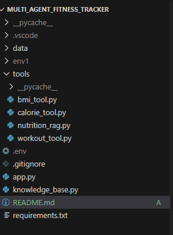

# Multi_Agent_Health_Traker

This project leverages multiple AI-powered tools, including BMI calculation, calorie estimation, workout planning, and a nutrition RAG system, to provide personalized fitness guidance. By integrating these tools within a unified agent framework, the application intelligently selects and executes the appropriate function to deliver accurate, context-aware health and fitness recommendations.

### Teck Stack Used:
✅ Python
✅ Streamlit (UI)
✅ LangChain + LangGraph (Agent + Tools)
✅ Google AI Studio / Gemini models
✅ FAISS (Vector Store)
✅ PDF text retrieval (PyPDFLoader & TextSplitter & FAISS & regex)
✅ dotenv for config , secreat key

### Project workflow:

>>>>>>> 0be50b7cb227e0882ba3f2c69f799f3b38811c3e
